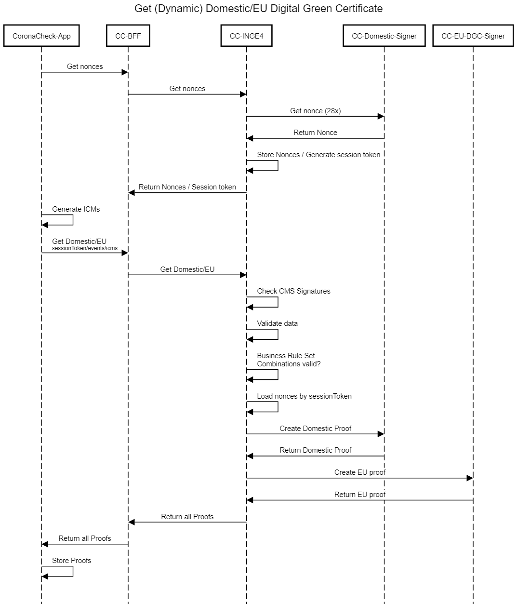

# nl-covid-19-coronacheck-backend-bizrules-signing-service (internally known als Inge-4)

**NOTE: This repository is a work in progress. If you plan to make non-trivial changes, we recommend to open an issue beforehand where we can discuss your planned changes.**

Inge4 receives (vaccination,recovery,test)Events and based on business rules sends them to the NL and EU signer.
Unomi and enrichment via rvig are added for the Coronacheck app.

There are various requesters which are all supported: mobile app (coronacheck) and printportaal.
There are various signers: eu, domestic static (paper) and domestic dynamic (app).

### Inge

Note that internally the systems used the names 'Inge-##'; where ## was some sequal number. As the course of the pandemic was unpredictable and often changed - some of those numbers never saw the light of day. For the DCC and Domestic certificates the two key systems (in addition to the website, the RIVM/GGD systems relied on, etc, etc) are the signing service (nl-covid-19-coronacheck-backend-bizrules-signing-service - internally known as inge number 4) and the nl-covid-19-coronacheck-access-holder-glue-service (build number 6).

## Installation
Create the required secrets that are used in settings.py. Usually these are stored in 
`SECRETS_FOLDER`, defaulting to "./secrets". Example secrets are in api/tests/secrets. Do NOT use examples in production.

This application uses the following secrets / secret keys.

* `inge4_NaCl`: Communication with nl-covid-19-coronacheck-access-holder-glue-servicee (internally known as Inge6)
* `inge6_NaCl.pub`: Communication with access holder service.
  
* `inge4_test.env`: Contains redis secrets. The Env config file contains secrets.
* `inge4_test_fail.env`: Key used for testing
* `inge6_jwt_public.pem`: Cert file for verifying jwts from inge6

* `jwt_private.key`: For jwt signing jwt in the mobile app
* `jwt_public.crt`: For jwt signing jwt in the mobile app
* `redis_hmac_key`: For data stored in redis
* `tvs-connect.test.coronacheck.nl.key.nopass`: Communication to RVIG (enrichment for mobile app)
* `vws_identity_hash_key.key`: Secret key for creating identity hashes

Additionally checking requests against a custom set of CA's: SIGNER_CA_CERT_FILE

Not required:
* `inge6_jwt_private.key`: ...
* `inge6_jwt_public.crt`: ...
* `inge4_NaCl.pub`: Derivative from inge4_NaCl for convenience checking if the inge6 data is correct.


### Vaccination providers:

The database of vaccination event providers used for data from the mobile app is stored in `vaccinationproviders.json5`.
This file contains keys per vaccination provider. The example in api/tests/secrets contains examples.


## Operations
Changes in configuration and secret/resource files require app restart.

### Deployment
Inge 4 is a python ASGI app written in FastAPI. Runs on python 3.8.
Run this with NGINX Unit or Uvicorn. Example: https://unit.nginx.org/howto/fastapi/

### Configuration
Configuration is read from two files:

- /etc/inge4/inge4.conf, fallback to inge4_development.conf
- /etc/inge4/logging.yaml, fallback to inge4_logging.yaml

### Resource files
This app uses various resource files, these are their origins:

* `partial_issuence_allowlist.csv`: strikelist, removes fields from domestic signing.
* `hpk-codes.json`: maps hpkcodes to vaccines and manufacturers. Content from https://hpkcode.nl/
* `required-doses-per-brand.json`: List of how many doses are needed per brand. Created by...
* `test-type.json`: https://github.com/ehn-dcc-development/ehn-dcc-schema/tree/main/valuesets
* `vaccine-mah-manf.json`: https://github.com/ehn-dcc-development/ehn-dcc-schema/tree/main/valuesets
* `vaccine-medicinal-product.json`: https://github.com/ehn-dcc-development/ehn-dcc-schema/tree/main/valuesets

### Logging
Edit the inge4_logging.yaml to acceptable settings. The shipped file logs everything including
all calls to all services.

### UCI / UVCI logging
A call to '/uci_test' on this application creates a sample UCI event from a test provider.
Use this call to validate that the 'written_to_logfile' is actually written. Since UCI
probably cannot read the file there is no test for that. This requires manual inspection. The file should
also grow over time, as a UCI is logged every time a EU certificate is made.

Logs can be formatted using the inge4_logging.yaml file, which contains a special section
for UCI. By default it ships with a uci_logfile with append rights.

An example log line is:
```
[INFO] [17/Jun/2021 09:41:35] [uci:447] {"uci": "URN:UCI:01:NL:Z6OXXDG33VFRLL4K7KB52JTN4E#O", "provider": "ZZZ", "unique": "UCI_TEST_EVENT"}
```

## Development
The inge4_development.env is used when running this in development and testing.

Requirements: Linux/Mac system with python3.8 and redis.
Make sure a redis-server is in your path. For mac users `brew install redis` should suffice.

For development run:
`make run`


## End to end test

Example / shipped settings are used below and can be changed in inge4_development.env.
Preferably by setting environment variables.

### Run the domestic signer
```
git clone https://github.com/minvws/nl-covid19-coronacheck-idemix-private/
add certs (todo, point to readme)
go run ./ server
```
Assuming:
DOMESTIC_NL_VWS_PREPARE_ISSUE_URL = http://localhost:4001/prepare_issue
DOMESTIC_NL_VWS_ONLINE_SIGNING_URL = http://localhost:4001/issue


### Run the eu signer:
```
git clone https://github.com/minvws/nl-covid19-coronacheck-hcert-private
add certs (todo, point to readme)
go run ./ server
```

Assuming:
EU_INTERNATIONAL_SIGNING_URL = http://localhost:4002/get_credential


### Use the inge6 staging acceptance environment:
INGE6_BSN_RETRIEVAL_URL = https://tvs-connect.acc.coronacheck.nl/bsn_attribute


### Run the rvig mock service:
This mocks https://raadplegen.sbv-z.nl on localhost:8001
```make run-mock mock_port=8001```

the url where it expects the sbv-z mock to live
can be changed by modifying the wsdl files in
api/enrichment/rvig_api/wsdl/mock

On some environments the make file is not available and one should execute:

```. .venv/bin/activate && python3 -m uvicorn api.mock:app --reload --port 8001 --host localhost```

Inside the inge-4 root instead. In order to restart the mock bpr service on
Inge-4 with new data one just needs to replace the contents of the data in 
`api/tests/test_data/pii_for_mock-v04.json`. The service is looking for 
file changes in this directory and if a file changed it will restart
automatically. If this is not the case then one should kill all processes 
listening on port 8001 and start the service again.


### Run:
Set the MOCK_MODE environment variable to True. Do NOT do this in the .env
but do this in your shell environment.

Bash example:
`export MOCK_MODE = True`

Fish example:
`set -x MOCK_MODE = True`

Then run:
`make run`

### Run the end to end test:
`make run examples`


### Docker

The Dockerfile of this project is only intended for development purposes and not hardened enough for production. In order to run this project with the default configuration run
```
docker compose up
```
and visit `localhost:8000/health` to see if it indeed is running correctly


## API Docs:
See docs/openapi.json
Online render: https://redocly.github.io/redoc/?url=https://github.com/91divoc-ln/inge-4/blob/main/docs/openapi.json


When running Inge-4 in development API Docs are available at:
```
http://localhost:8000/docs/
http://localhost:8000/redoc/
```


## Process overview

This software currently supports two processes:

### Process 1: health professional

Case: A citizen goes to their health professional and asks for a "Proof of Vaccination".


### Process 2: dutch citizen opt-in

Step 1:


Step 2:


Higher level view of step 2:



## Authors

- Implementation / Docs: Elger Jonker, Maarten Derickx, Tomas Harreveld, Willem van Asperen, Max Vasterd
- Process: Nick ten Cate, Anne Jan Brouwer, Mendel Mobach, Ivo Jansch

## Development & Contribution process

The development team works on the repository in a private fork (for reasons of compliance with existing processes) and shares its work as often as possible.

If you plan to make non-trivial changes, we recommend to open an issue beforehand where we can discuss your planned changes. This increases the chance that we might be able to use your contribution (or it avoids doing work if there are reasons why we wouldn't be able to use it).

Note that all commits should be signed using a gpg key.

## Security

Security issues can be reported through a github issue, at https://coronacheck.nl/nl/kwetsbaarheid-melden or confidentially through the https://www.ncsc.nl/contact/kwetsbaarheid-melden.

