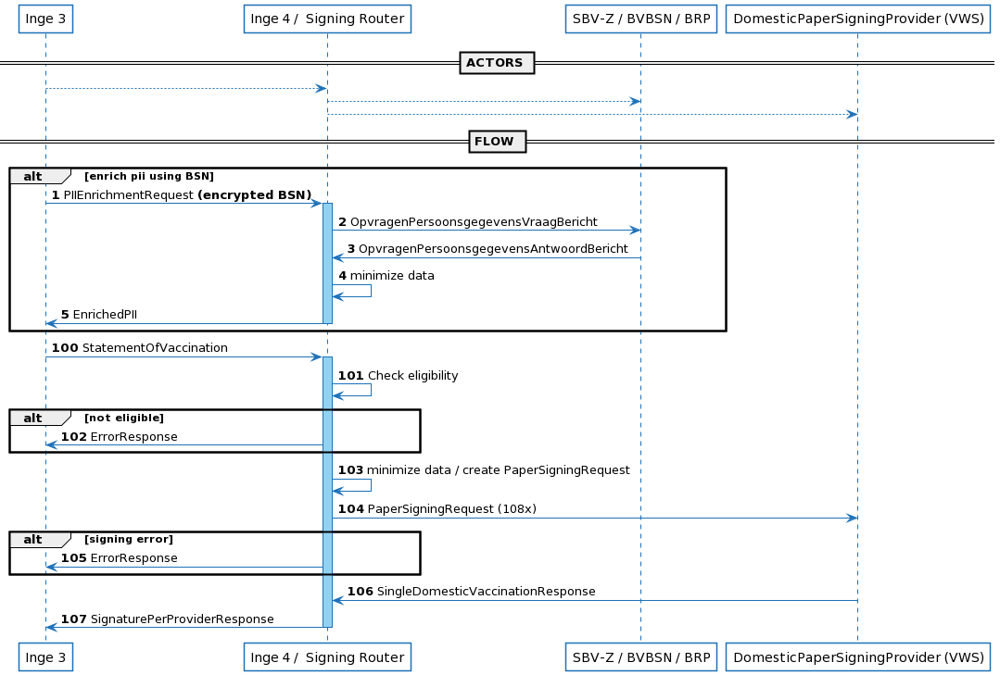
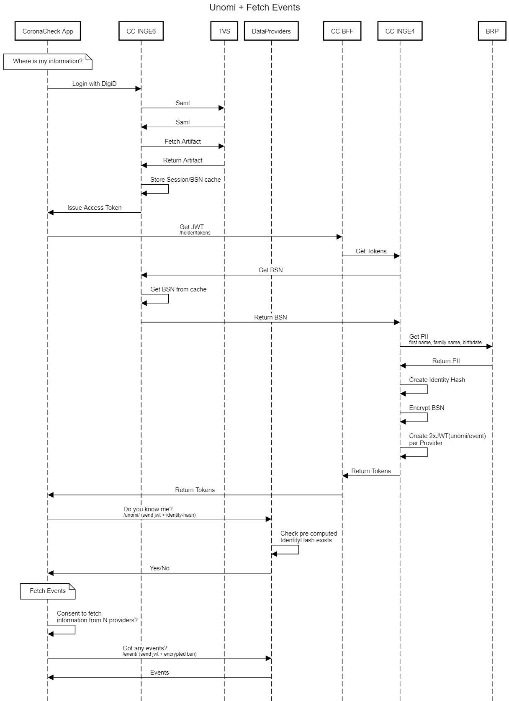
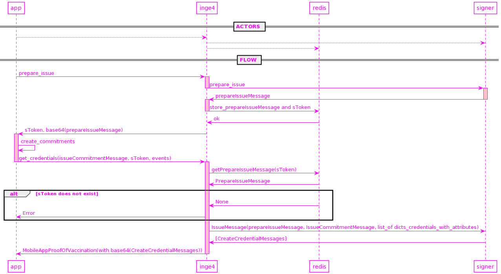

# Inge-4
This service signs "Statement of Vaccination" documents, converting them to a "Proof of Vaccination".
Contains several supporting methods for the 'unomi' protocol, data enrichment via SBV-Z and BSN retrieval.

## Requirements
- Respond within 2 seconds

## Signing architecture:
There are various requesters which are all supported: mobile app, inge3 and printportaal.
There are various signers: eu, domestic static and domestic dynamic.

These are mapped in app.py.

## Installation
Create the required secrets that are used in settings.py. Usually these are stored in 
`SECRETS_FOLDER`, defaulting to "./secrets".

The secrets needed are:

- vaccinationproviders.json5 - a database of vaccination providers, used for the mobile app
- jwt_private.key - For jwt sigingin in the mobile app
- sbvz-connect.test.brba.nl.cert - For data enrichment in the mobile app

Some examples are stored in 'tests/secrets'. Do NOT use these examples in production!


## Operations

### Deployment
Inge 4 is a python ASGI app written in FastAPI. Runs on python 3.8.
Run this with NGINX Unit or Uvicorn. Example: https://unit.nginx.org/howto/fastapi/


### Configuration:
Configuration is read from two files:

- /etc/inge4/inge4.conf, fallback to inge4_development.conf
- /etc/inge4/logging.yaml, fallback to inge4_logging.yaml

### Updating vaccinationproviders:
Adding vaccination providers to vaccinationproviders.json requires an app restart.


## Development

For development run:
`make run`

### Docker

The Dockerfile of this project is only intended for development purposes and not hardened enough for production. In order to run this project with the default configuration run
```
docker compose up
```
and visit `localhost:8000/health` to see if it indeed is running correctly


## API Docs:
See docs/openapi.json
Online render: https://redocly.github.io/redoc/?url=https://github.com/91divoc-ln/inge-4/blob/main/docs/openapi.json

Uses x-inge4-api-key header for security. Setting is called API_KEY in settings.env.

When running Inge-4 in development API Docs are available at:
```
http://localhost:8000/docs/
http://localhost:8000/redoc/
```


## Process overview

This software currently supports two processes:

### Process 1: health professional

Case: A citizen goes to their health professional and asks for a "Proof of Vaccination".




### Process 2: dutch citizen opt-in

Step 1:


Step 2:



## Authors

- Implementation / Docs: Elger Jonker
- Process: Nick ten Cate, Anne Jan Brouwer, Mendel Mobach, Ivo Jansch
